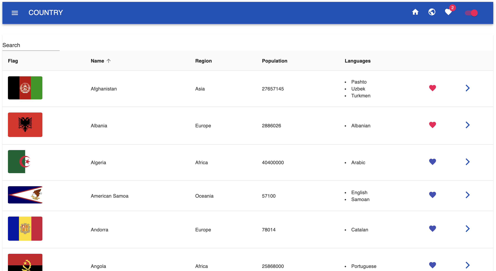
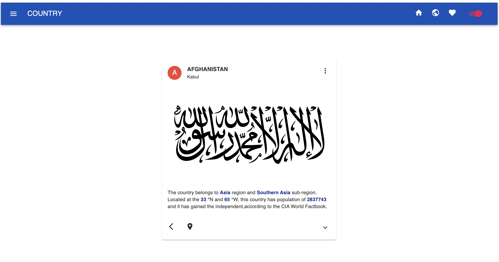

# React assignment

This assignment is to practice TypeScript

### How to run project

1. Step 1: yarn
2. Step 2: yarn start

### Requirements

1. Fetch data from this API: https://restcountries.com/v3.1/all
2. The user can search country by name
3. Get country detail by this API: https://restcountries.com/v3.1/name/{name}
4. When the user click to country name or a button it should show country detail
5. The country detail should have name, region, population, flag and list of languages
6. The user can add country to Favorite page
7. When the user add a country to Favorite the favorite icon should change the color.
8. Have a Loading page while fetching data

### Code style Requirements

1. Naming convention
2. Clear file structure
3. Divided the project to small components
4. Clean code: no console.log, no dead code,
5. Format code (Prettier - Code formatter)
6. Separate import from your own file and the import from the package

### Extra requirements

ONLY DO THIS PART WHEN YOU HAVE COMPLETED THE REQUIREMENTS PART

1. When the user add country to favorite list, the website should show a message: `A country is added to the favorite list`
2. Sorting by country name
3. Deploy the project

### Useful sources

1. API information: https://restcountries.com/
2. Alert: https://mui.com/material-ui/react-snackbar/#main-content
3. Table: https://mui.com/material-ui/react-table/#basic-table
4. Data grid: https://mui.com/x/react-data-grid/components/#main-content
5. Font: https://fonts.google.com/specimen/Nunito
6. Deploy: https://vercel.com/, https://www.netlify.com/
7. Prettier - Code formatter - Extension in VSCode

### Screenshots

## Deply Link
https://coruscating-concha-7b67a8.netlify.app/